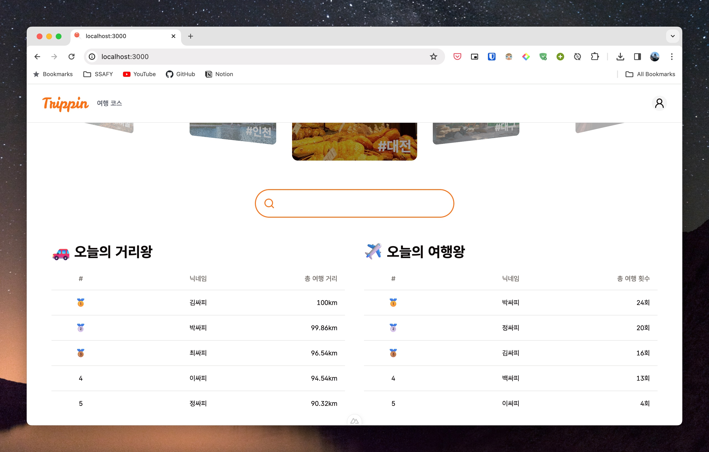
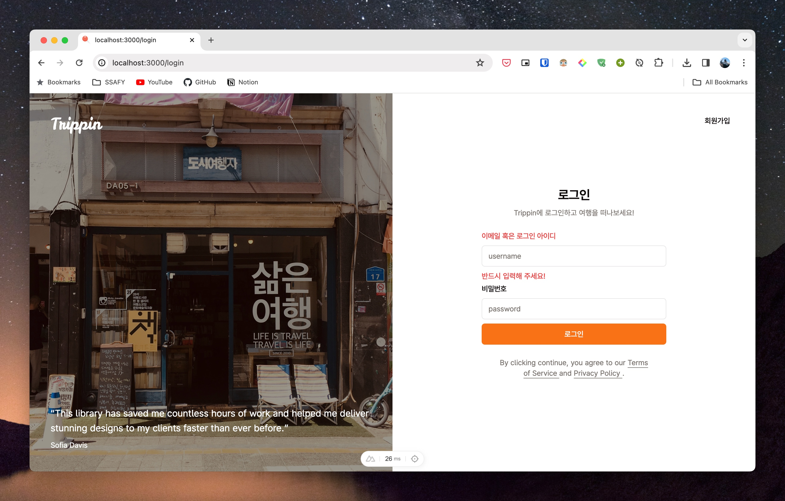

# 관통 프로젝트 - Trippin

---

## Table of Contents

- [관통 프로젝트 - Trippin](#관통-프로젝트---trippin)
  - [Table of Contents](#table-of-contents)
  - [Member](#member)
  - [💡 Concept](#-concept)
    - [여행을 게임처럼](#여행을-게임처럼)
      - [핵심 기능](#핵심-기능)
      - [추가 기능](#추가-기능)
  - [🏠 Service Layout](#-service-layout)
    - [메인 페이지](#메인-페이지)
    - [회원가입 / 로그인](#회원가입--로그인)
    - [여행 코스 목록](#여행-코스-목록)
    - [여행 코스 세부사항](#여행-코스-세부사항)
  - [🛠️ Skills](#️-skills)
    - [language](#language)
    - [framework](#framework)
    - [database](#database)
  - [🏗️ UML](#️-uml)
  - [💾 ERD](#-erd)
  - [⚙️ Function](#️-function)
    - [🎯 회원](#-회원)
    - [🎯 코스](#-코스)
    - [🎯 업적](#-업적)

---

## Member

| FE                                                                 | BE                                                                    |
| ------------------------------------------------------------------ | --------------------------------------------------------------------- |
|  |  |
| [정필모(itsmo1031)](https://github.com/itsmo1031)                  | [박철준(cheoljunpark)](https://github.com/cheoljunpark)               |

---

## 💡 Concept

### 여행을 게임처럼

- 여행 코스를 제공하고, 코스를 도전하며 클리어함으로써 재미를 추구하는 Gamification 서비스

#### 핵심 기능

- 코스를 진행하면, 각 관광지별로 위치가 인증되어야만 다음 관광지를 인증할 수 있음.
- 코스 내 모든 관광지가 인증되면 한 코스 클리어!

#### 추가 기능

- 랭킹 시스템: 여행 거리별, 횟수별 유저들의 랭킹 출력
- SNS 시스템: 회원간 팔로우, 팔로잉 기능
- 업적/뱃지 시스템: 여행 거리, 횟수 등 유저들의 행동에 따른 업적 산출 및 뱃지 제공

## 🏠 Service Layout

### 메인 페이지

### 회원가입 / 로그인

### 여행 코스 목록

### 여행 코스 세부사항

---

## 🛠️ Skills

### language

- **Frontend** : HTML, CSS, TypeScript, Vue.js
- **Backend**: Java 8

### framework

- **Frontend** : Nuxt.js, TailwindCSS
- **Backend**: Spring Boot, JPA

### database

- MySQL 8

---

## 🏗️ UML

## 💾 ERD

---

## ⚙️ Function

### 🎯 회원

💡 회원 관리는 기본적으로 Spring Security와 JWT를 활용

- [x] 회원 가입
- [x] 로그인 / 로그아웃
- [ ] 마이페이지
- [ ] 프로필 사진 업로드 / 삭제
- [ ] 회원 탈퇴
- [ ] 랭킹 조회
- [ ] 팔로잉 / 팔로우

### 🎯 코스

💡 공공데이터포털 OPEN API를 활용

- [x] 전체 코스 정보 조회
- [x] 코스 세부사항 조회(코스별 각 관광지)
- [ ] 코스 도전
- [ ] 도전한 코스별 진행상황
- [ ] 코스 각 관광지에 대한 지도 정보(Kakao Map API)

### 🎯 업적

- [ ] 업적 리스트
- [ ] 업적 달성시 뱃지 지급
- [ ] 보유한 뱃지 조회
